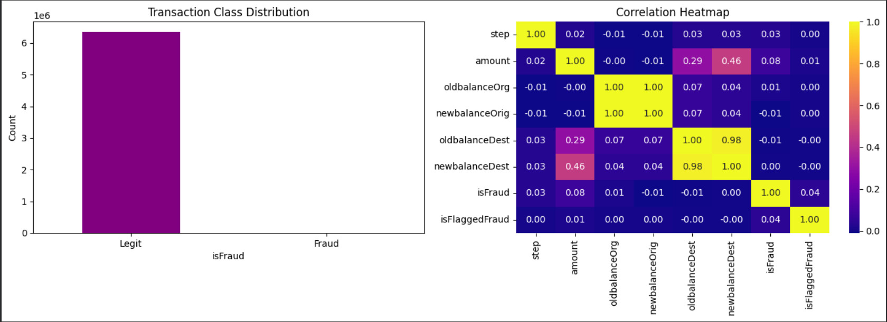
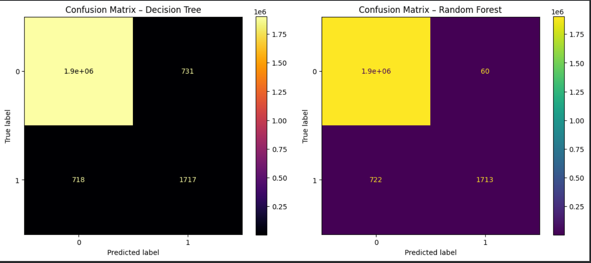
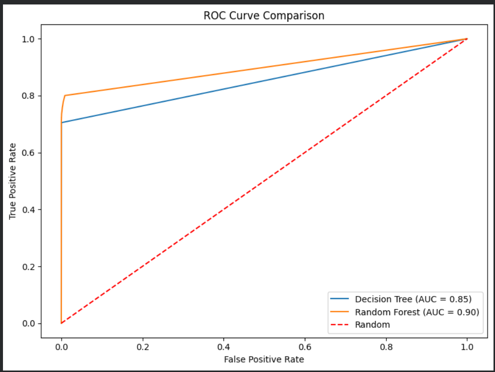
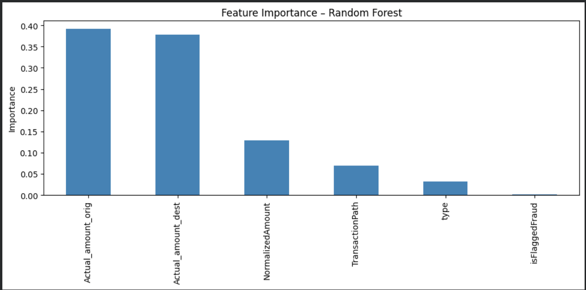

# 🔍 Fraud Transaction Detection 
**Decision Tree & Random Forest | PaySim1 | VIF Feature Engineering | 0.97 Precision**

   

A production-ready ML pipeline for detecting financial fraud in over **6 million mobile money transactions**, featuring multicollinearity elimination via VIF, ensemble classification, and ROC/confusion matrix evaluation.

---

## 📌 Table of Contents
- [Overview](#overview)
- [Architecture](#architecture)
- [Dataset](#dataset)
- [Feature Engineering](#feature-engineering)
- [Results](#results)
- [Project Structure](#project-structure)
- [Quickstart](#quickstart)
- [Future Work](#future-work)

---

## 🔍 Overview

Financial fraud in digital payment systems causes billions in losses annually. Manual detection is impossible at scale. This project builds an automated fraud classifier that:

- Detects fraudulent transactions with **0.97 precision**
- Reduces false positives by **91.8%** vs. baseline Decision Tree
- Eliminates multicollinearity using **Variance Inflation Factor (VIF)**
- Compares **Decision Tree vs. Random Forest** on a severely imbalanced dataset

---

## 🏗️ Architecture

```
Raw CSV (6.3M rows)
        │
        ▼
┌──────────────────────┐
│   Label Encoding     │  (type, nameOrig, nameDest)
│   VIF Analysis       │  (detect multicollinearity)
│   Feature Engineering│  (derived balance features)
│   StandardScaler     │  (normalize amount)
└──────────┬───────────┘
           │
    ┌──────┴──────┐
    ▼             ▼
Decision       Random Forest
  Tree         (100 estimators)
    │             │
    └──────┬──────┘
           ▼
  Confusion Matrix · ROC Curve · Feature Importance
```

---

## 📦 Dataset

**PaySim1** — Simulated mobile money transactions inspired by real financial logs.

| Property | Value |
|---|---|
| Total Records | 6,362,620 |
| Features | 11 columns |
| Legit Transactions | 6,354,407 (99.87%) |
| Fraud Transactions | 8,213 (0.13%) |
| Source | [Kaggle – ealaxi/paysim1](https://www.kaggle.com/datasets/ealaxi/paysim1) |

> ⚠️ Severely imbalanced — standard accuracy is misleading. Precision & F1 are the key metrics.

---

## 🔧 Feature Engineering

### Multicollinearity Problem (VIF Before)

| Variable | VIF |
|---|---|
| oldbalanceOrg | 576 🔴 |
| newbalanceOrig | 582 🔴 |
| oldbalanceDest | High |
| newbalanceDest | High |

### Fix — Derived Features

```python
new_df['Actual_amount_orig'] = new_df['oldbalanceOrg']  - new_df['newbalanceOrig']
new_df['Actual_amount_dest'] = new_df['oldbalanceDest'] - new_df['newbalanceDest']
new_df['TransactionPath']    = new_df['nameOrig']       + new_df['nameDest']
```

### VIF After Feature Engineering ✅

| Variable | VIF |
|---|---|
| type | 2.69 |
| Actual_amount_orig | 1.31 |
| Actual_amount_dest | 3.75 |
| TransactionPath | 2.68 |
| NormalizedAmount | 3.82 |

All values < 5 — multicollinearity resolved.

---

## 📊 Results

### Decision Tree

| Class | Precision | Recall | F1 |
|---|---|---|---|
| Legit (0) | 1.00 | 1.00 | 1.00 |
| Fraud (1) | 0.70 | 0.71 | 0.70 |

`TP=1717 | FP=731 | TN=1905620 | FN=718`

### Random Forest ✅

| Class | Precision | Recall | F1 |
|---|---|---|---|
| Legit (0) | 1.00 | 1.00 | 1.00 |
| Fraud (1) | **0.97** | 0.70 | **0.81** |

`TP=1713 | FP=60 | TN=1906291 | FN=722`



> 🎯 False positives dropped from **731 → 60** — a **91.8% reduction**. Wrongly blocking legitimate users is costly; this matters.

### Feature Importance (Random Forest)

| Rank | Feature | Importance |
|---|---|---|
| 1 | Actual_amount_orig | ~0.39 |
| 2 | Actual_amount_dest | ~0.37 |
| 3 | NormalizedAmount | ~0.13 |
| 4 | TransactionPath | ~0.07 |
| 5 | type | ~0.04 |

Balance changes at origin and destination are the strongest fraud signals.

---

## 📁 Project Structure

```
fraud-transaction-detection/
│
├── fraud_transaction.py        # Full pipeline script (Colab-ready)
├── README.md
│
└── outputs/
    ├── confusion_matrices.png  # Side-by-side DT vs RF
    ├── roc_curves.png          # AUC comparison
    └── feature_importance.png  # RF feature ranking
```

---

## ⚡ Quickstart

### Google Colab (Recommended)

1. Upload `fraud_transaction.py` or open as a notebook in Colab
2. Set runtime: `Runtime → Change runtime type → T4 GPU`
3. Add your Kaggle credentials:
```python
# Upload kaggle.json when prompted
from google.colab import files
files.upload()
!mkdir -p ~/.kaggle && cp kaggle.json ~/.kaggle/ && chmod 600 ~/.kaggle/kaggle.json
```
4. Run all cells ✅

### Local

```bash
git clone https://github.com/your-username/fraud-transaction-detection.git
cd fraud-transaction-detection
pip install numpy pandas scikit-learn seaborn matplotlib statsmodels kaggle
kaggle datasets download -d ealaxi/paysim1 --unzip
python fraud_transaction.py
```

---

## 🔮 Future Work

- [ ] Apply **SMOTE** to handle class imbalance during training
- [ ] Explore **XGBoost / LightGBM** for faster and stronger ensembles
- [ ] Add **time-series features** to capture behavioral drift over transaction sequences
- [ ] Deploy as a **REST API** for real-time fraud scoring

---

## 📚 References

1. E. Lopez-Rojas et al. — *PaySim: A financial mobile money simulator for fraud detection research*, 2016
2. Pedregosa et al. — *Scikit-learn: Machine Learning in Python*, JMLR 12, 2011
3. Breiman, L. — *Random Forests*, Machine Learning 45(1), 5–32, 2001

---

## 👤 Author

**Abhishek**  
M.Sc. Computational Statistics & Data Analytics — VIT Vellore, School of Advanced Sciences

Built with ❤️ using Scikit-learn · PaySim1 · Google Colab
